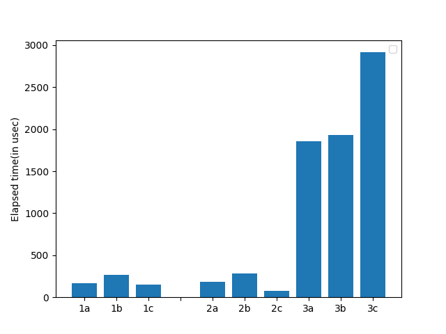

## TASK 3 by Plastinin Alexander

### Build

Make sure you are in `os_23_24/task_3/plastinin`, then run

```
mkdir build && cd build
cmake ..
make
```

### Run

To run program you need to specify input file and running mode.

There are 3 possible modes for you:
1. `--shm` - file is sent via shared memory
2. `--queue` - file is sent via message queue
3. `--fifo` - file is sent via fifo

### Analysis

We've run this program in each mode for 3 file sizes: small - 400 bytes, medium - 4 Kb, big - around 4 Mb. In each mode program was runned 10 times, then we calculated average elapsed time. You can see it below on the diagram.


>1 - small file, 2 - medium file, 3 - big file, a - shared memory, b - fifo, c - queue

From this diagram we can see, that message queue is the best for sending small and medium files, but it loses on the big size, where shared memory is the best.
