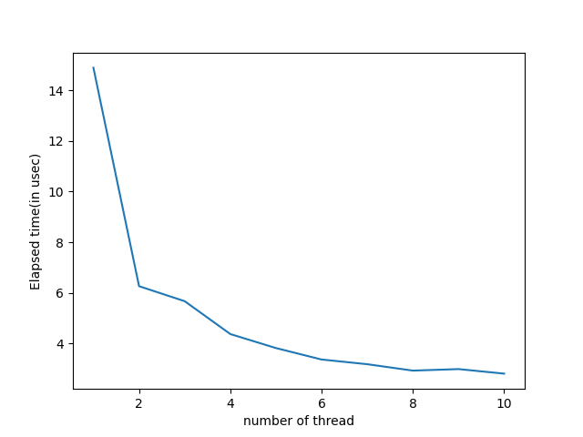
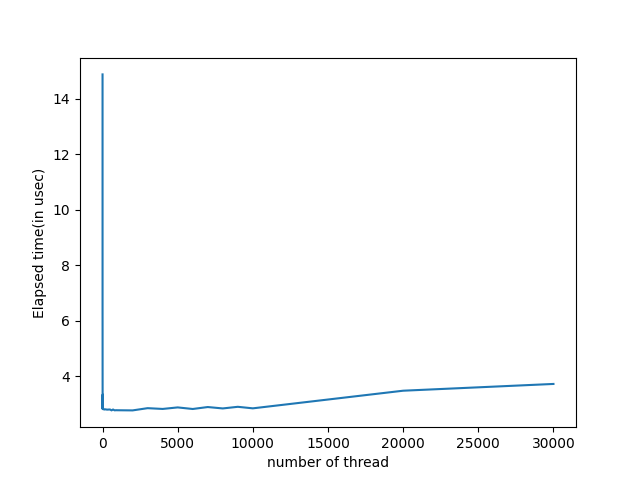

## TASK 4 by Plastinin Alexander

### Overview

This task is dedicated to paralleling calculation of integral by using Monte-Carlo method.

### Build

Make sure you are in `os_23_24/task_4/plastinin`, then run

```
mkdir build && cd build
cmake ..
make
```

### Run

To run program you need to specify number of threads and output. (Only in this sequence)

`./task_4 <n_thread> <output_file>`

Example:

`./task_4 5 data.csv`

### Analysis

We've run this program with different number of threads: from 1 to 40000 and measured elapsed time for each case.

This is the graph for number of threads from 1 to 10.



And also for threads from 1 to 40000.



We can notice, that time is reaching it's plateau when n_thread = 8. From this we are concluding, that number of cores in out computer is 8, which is true.
